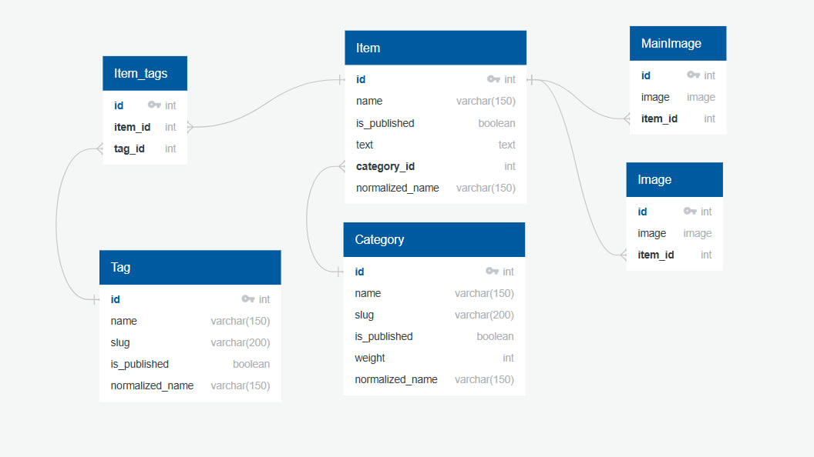

# Lyceum (проект на Django)

[](https://gitlab.crja72.ru/django/2026/spring/course/students/377070-damirkhodzhiev-course-1585/-/commits/main)

Учебный проект с использованием фреймворка Django. 

## Необходимое ПО
- [Python](https://www.python.org/downloads/release/python-3120/) (3.12), версии подходящие под джанго 5.2: 3.10, 3.11, 3.12, 3.13, 3.14
- [Git](https://git-scm.com/install/linux)

## Использование
Чтобы установить и запустить проект на Linux, нужно выполнить следующие действия:

Клонировать репозиторий с помощью команды:
```sh
git clone https://gitlab.crja72.ru/django/2026/spring/course/students/377070-damirkhodzhiev-course-1585.git lyceum
```

Далее перейти в папку с проектом:
```sh
cd lyceum
```
Создание виртуального окружения:
```sh
python3 -m venv venv
```
Активация: 
```sh
source venv/bin/activate
```
Теперь нужно клонировать файл-шаблон с переменными окружения:
```sh
cp template.env .env
```
<sub>(p.s. конечно же надо будет заполнить потом настоящие данные, а не оставлять как есть :D)</sub>


Установка основных зависимостей:
```sh
pip install -r requirements/prod.txt
```

Если проект требуется запустить в dev режиме:
```sh
pip install -r requirements/dev.txt
```

Далее перейти в папку с manage.py:
```sh
cd lyceum
```

Далее выполнить команду миграции:
```sh
python3 manage.py migrate
```

Создание суперпользователя:
```sh
python3 manage.py createsuperuser
```
<sub>Введите имя пользователя (username), email и пароль.</sub>

Запуск приложения:
```sh
python3 manage.py runserver
```
Проект будет доступен по адресу: http://127.0.0.1:8000/

## CI/CD
В файле [.gitlab-ci.yml](https://gitlab.crja72.ru/django/2026/spring/course/students/377070-damirkhodzhiev-course-1585/-/blob/main/.gitlab-ci.yml) настроены первоначальные проверки. Пайплайн будет запускаться сразу же после коммита в репозиторий.

## Команда проекта
- **Дамир** (я) - разработчик и лид проекта
- **Деник** (кот) - моральная поддержка и тестирование методом хождения по клавиатуре

## Зачем вы разработали этот проект?
Чтобы был.

## ERD

